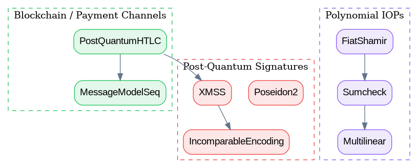
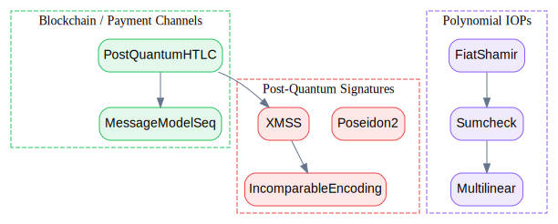

# Lean Ethereum Post-Quantum Cryptography Formalization

<p align="center">
  
</p>

## Overview

This repository contains a **machine-checked formalization** of post-quantum cryptographic primitives and proof systems for Ethereum, implemented in Lean 4. The work integrates foundational components from the [leanEthereum](https://github.com/leanEthereum) ecosystem into a formally verified framework.

### Why This Matters

Ethereum's transition to post-quantum security is critical for long-term blockchain resilience. Current signature schemes (ECDSA, BLS) are vulnerable to quantum attacks. This formalization provides:

1. **Verified Foundations**: Machine-checked specifications for post-quantum signature schemes (XMSS/LeanSig)
2. **Proof System Infrastructure**: Formalized Polynomial IOPs (Sumcheck, Fiat-Shamir) enabling zkSNARK/STARK verification
3. **Application Layer**: Post-quantum Hash Time-Locked Contracts (HTLCs) for payment channels

The work follows the cryptographic specifications from:
- [Hash-Based Multi-Signatures for Post-Quantum Ethereum](https://eprint.iacr.org/2025/055.pdf) (Drake, Khovratovich, Kudinov, Wagner)
- [LeanSig for Post-Quantum Ethereum](https://eprint.iacr.org/2025/1332.pdf)

## Key Achievements

### Post-Quantum Signatures

| Module | Description | Status |
|--------|-------------|--------|
| `IncomparableEncoding` | Abstract interface for XMSS-style encodings | ✅ Complete |
| `XMSS` | Stateful signature scheme with epoch-based freshness | ✅ Complete |
| `Poseidon2` | Algebraic hash function specification | ✅ Complete |

### Polynomial IOPs

| Module | Description | Status |
|--------|-------------|--------|
| `Multilinear` | Multilinear polynomial representation | ✅ Complete |
| `Sumcheck` | Sumcheck protocol verification equations | ✅ Complete |
| `FiatShamir` | Non-interactive transform (Random Oracle Model) | ✅ Complete |

### Blockchain Integration

| Module | Description | Status |
|--------|-------------|--------|
| `MessageModelSeq` | Replay prevention via monotone sequence numbers | ✅ Complete |
| `PostQuantumHTLC` | PQ hash-locks for payment channels | ✅ Complete |

### Quality Metrics

- **8 modules** with clean interfaces
- **Zero `sorry` or `admit`** placeholders
- **No unverified axioms** — security assumptions expressed as `Prop` parameters
- **Warnings-as-errors** compilation verified

## Repository Structure

```
├── README.md                     # This file
├── TECHNICAL_REPORT.md           # Detailed technical documentation
├── RESEARCHER_BUNDLE/            # Self-contained verification environment
│   ├── HeytingLean/
│   │   ├── Crypto/
│   │   │   ├── PostQuantum/      # XMSS, Poseidon2, IncomparableEncoding
│   │   │   └── PIOP/             # Sumcheck, FiatShamir, Multilinear
│   │   └── Blockchain/
│   │       ├── Bridge/           # MessageModelSeq
│   │       └── PaymentChannels/  # PostQuantumHTLC
│   ├── lakefile.lean
│   ├── lean-toolchain
│   ├── scripts/
│   │   ├── verify_build.sh       # Main verification script
│   │   └── generate_graph.py     # Visualization generator
│   └── artifacts/visuals/        # Generated diagrams
└── docs/
    ├── 01_Module_Map.md
    ├── 02_Proof_Index.md
    └── 03_Reproducibility.md
```

## Visualizations

### Module Dependency Graph

<p align="center">
  
</p>

### Interactive 3D Visualization

Open [`RESEARCHER_BUNDLE/artifacts/visuals/module_graph_3d.html`](RESEARCHER_BUNDLE/artifacts/visuals/module_graph_3d.html) in a browser for an interactive 3D view of the module graph with physics-based layout.

## Quick Start

### Prerequisites

- [Lean 4](https://leanprover.github.io/lean4/doc/setup.html) (v4.24.0)
- [elan](https://github.com/leanprover/elan) (Lean version manager)

### Verification

```bash
cd RESEARCHER_BUNDLE
./scripts/verify_build.sh
```

Or manually:

```bash
cd RESEARCHER_BUNDLE
lake update
lake build -- -DwarningAsError=true
```

Expected output:
```
=== VERIFICATION PASSED ===
All modules compile without sorry/admit.
```

## Technical Highlights

### Incomparable Encodings

The core primitive enabling XMSS-style signatures. Our formalization captures:

```lean
structure Scheme where
  encode : Param → Epoch → Rand → Msg → Option Code
  decode : Param → Epoch → Code → Option Msg

def Correct (S : Scheme) : Prop := ∀ pp e r m c,
  S.encode pp e r m = some c → S.decode pp e c = some m

def Incomparable (S : Scheme) : Prop := ∀ pp e r₁ r₂ m₁ m₂ c,
  m₁ ≠ m₂ → S.encode pp e r₁ m₁ = some c → S.encode pp e r₂ m₂ ≠ some c
```

### Stateful Signatures with Epoch Freshness

XMSS signatures are inherently stateful — each (key, epoch) pair can only sign once. We model this using the same pattern as our replay-prevention framework:

```lean
def EpochAdvances (S : XMSSScheme) : Prop := ∀ kp e m sig kp',
  S.sign kp e m = some (sig, kp') → kp'.epochIdx > kp.epochIdx
```

### Sumcheck Protocol

The foundation for modern zkSNARKs/STARKs. Our specification includes:

- Multilinear polynomial evaluation over boolean hypercubes
- Round-by-round verification equations
- Completeness/soundness as named `Prop` statements

## Future Work

| Area | Description | Priority |
|------|-------------|----------|
| **AIR Refinement** | Connect VM semantics to AIR constraints | Medium |
| **Test Vectors** | JSON fixtures from leanSig/leanMultisig binaries | Medium |
| **Soundness Proofs** | Full Sumcheck soundness theorem | Low |
| **STARK Integration** | Connect to existing STARK skeleton | Low |

## References

### Primary Sources

1. Drake, Khovratovich, Kudinov, Wagner. "Hash-Based Multi-Signatures for Post-Quantum Ethereum." ePrint 2025/055. https://eprint.iacr.org/2025/055.pdf

2. "Technical Note: LeanSig for Post-Quantum Ethereum." ePrint 2025/1332. https://eprint.iacr.org/2025/1332.pdf

3. Grassi et al. "Poseidon2: A Faster Version of the Poseidon Hash Function." ePrint 2023/323.

### Upstream Implementations

- [leanEthereum/leanSig](https://github.com/leanEthereum/leanSig) — Rust implementation of synchronized signatures
- [leanEthereum/leanMultisig](https://github.com/leanEthereum/leanMultisig) — zkVM with XMSS aggregation
- [leanEthereum/multilinear-toolkit](https://github.com/leanEthereum/multilinear-toolkit) — Sumcheck implementation
- [leanEthereum/fiat-shamir](https://github.com/leanEthereum/fiat-shamir) — Fiat-Shamir transcript management

## License

This work is released under the MIT License. See [LICENSE](LICENSE) for details.

## Acknowledgments

This formalization is part of the [HeytingLean](https://github.com/Abraxas1010/heyting) project, which aims to provide machine-checked foundations for advanced mathematical and cryptographic structures.

---

<p align="center">
  <em>Machine-verified cryptography for post-quantum Ethereum</em>
</p>
